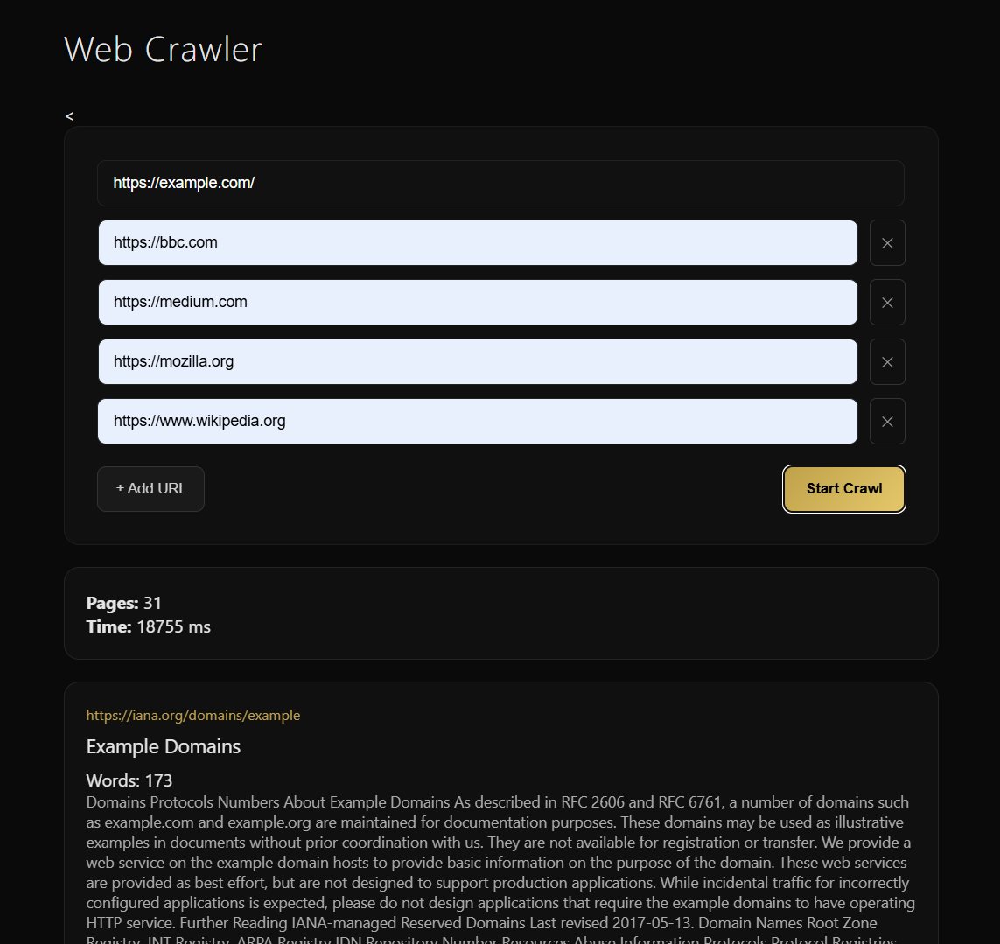
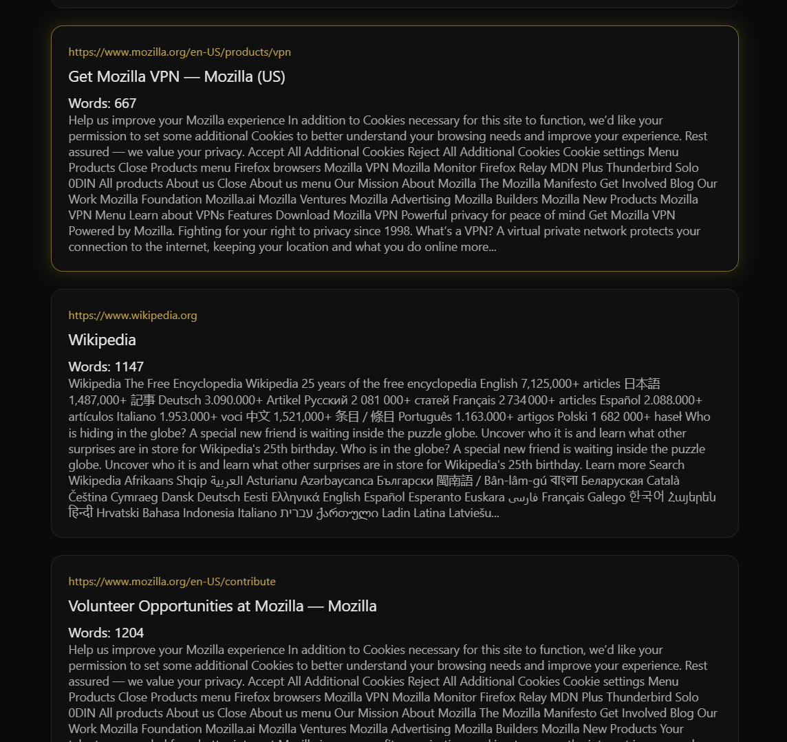
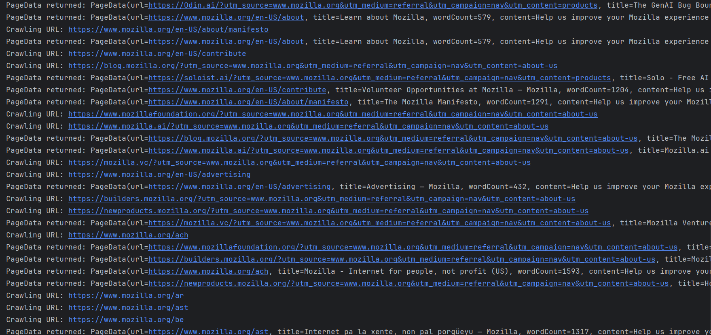

# 🚀 Multi-Threaded Web Crawler

A concurrent web crawler built using **Java + Spring Boot** that performs BFS-based crawling with depth limits, page limits, and thread-safe aggregation.
📂 GitHub: https://github.com/harshitsinha11/Web-Crawler  

---

## 📌 Overview

This project implements a **multi-threaded web crawler** that:

- Accepts up to 5 seed URLs
- Crawls pages concurrently using a fixed thread pool
- Performs Breadth-First Search (BFS)
- Enforces maximum depth (default: 5)
- Enforces maximum page count (default: 30)
- Extracts structured metadata:
  - Page Title
  - Word Count
  - Text Snippet (first 1000 characters)
- Returns results via a REST API
- Includes a modern, premium dark-themed frontend UI

---

## 🧠 Architecture Overview

```
Client (HTML / JS)
↓
REST Controller (/crawl/start)
↓
CrawlService
↓
ExecutorService (5 Worker Threads)
↓
BlockingQueue<CrawlData> → BFS Traversal
ConcurrentHashMap<String, PageData> → Thread-safe Storage
```

---

## ⚙️ Concurrency Design

| Component | Purpose |
|------------|----------|
| `ExecutorService` | Fixed-size worker pool (5 threads) |
| `BlockingQueue` | BFS crawl task coordination |
| `ConcurrentHashMap` | Thread-safe result aggregation |
| `AtomicInteger` | Global page limit enforcement |

### Why Fixed Thread Pool?

- Predictable concurrency
- Controlled resource usage
- Suitable for I/O-bound workloads
- Prevents uncontrolled thread growth

---

## 📂 Project Structure

```
multithreaded-web-crawler/
│
├── src/
│   ├── main/
│   │   ├── java/dev/harshit/crawler/
│   │   │   ├── controller/
│   │   │   │   └── CrawlController.java
│   │   │   ├── service/
│   │   │   │   └── CrawlService.java
│   │   │   ├── core/
│   │   │   │   └── PageCrawl.java
│   │   │   ├── model/
│   │   │   │   ├── PageData.java
│   │   │   │   └── CrawlResponse.java
│   │   │   ├── utils/
│   │   │   │   └── HtmlUtils.java
│   │   │   └── CrawlerApplication.java
│   │   │
│   │   └── resources/
│   │       ├── static/
│   │       │   ├── index.html
│   │       │   ├── css/
│   │       │   └── js/
│   │       └── application.properties
│
├── pom.xml
└── README.md
```
---

## 🔄 How It Works

### 1️⃣ Input

Frontend sends up to 5 seed URLs via:

### Endpoint

```http
POST /crawl/start
```

---

### 2️⃣ Initialization

- Seed URLs added to `BlockingQueue`
- 5 worker threads created using `ExecutorService`

---

### 3️⃣ Worker Execution

Each worker thread:

1. Polls URL from queue  
2. Skips if:
   - Depth exceeded
   - Already visited
3. Crawls page
4. Extracts metadata
5. Extracts child links
6. Adds new tasks to queue (if depth allows)
7. Stores result in `ConcurrentHashMap`

---

### 4️⃣ Termination

- Stops when `MAX_PAGES` reached
- Uses `awaitTermination()` to wait for all threads
- Builds final `CrawlResponse`

---

## 🎨 Frontend Features

- Dynamic URL input (max 5)
- Remove URL option
- Loading spinner
- Glassmorphism result cards
- Hover glow animation
- Modern luxury dark UI

---

## 🛠 Tech Stack

### Backend
- Java 17+
- Spring Boot
- JSoup
- Maven
- ExecutorService

### Frontend
- HTML
- CSS (Glassmorphism UI)
- Vanilla JavaScript

---

## ▶️ Running Locally

### 1. Clone the Repository
```bash
git clone https://github.com/harshitsinha11/Web-Crawler.git
```

### 2. Run Application
```bash
mvn spring-boot:run
```

### 3. Access Application
```bash
http://localhost:9000/index.html
```
---

## 📈 Future Improvements

- Domain restriction support
- Crawl politeness delay
- Async job queue architecture
- Database persistence
- Distributed crawling
- Graph visualization of crawl tree

---

## 🎯 Learning Outcomes

This project strengthened understanding of:

- Thread lifecycle management
- Concurrency safety
- Shared state synchronization
- BFS in concurrent systems
- REST API design
- Frontend + backend integration
- Production deployment

---

## 📷 Demo

### 🏠 Home


### 🧵 Code


### 🌐 Crawled Results


### 🚀 Logs


---

## 📄 License

MIT License

---

## 👨‍💻 Author

Harshit Sinha  
B.Tech Computer Science  
Passionate about backend systems, concurrency and cloud computing.


